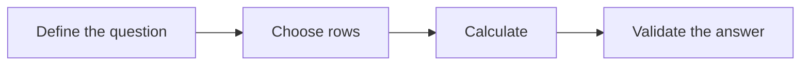
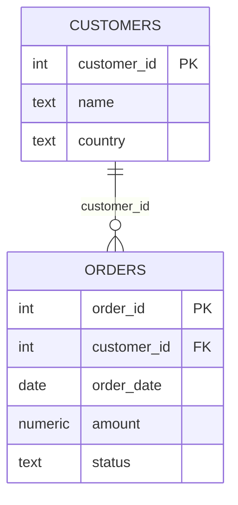
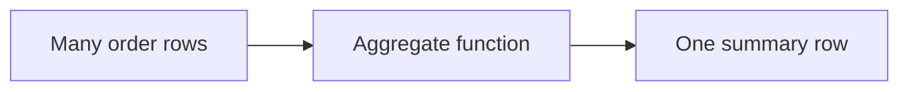
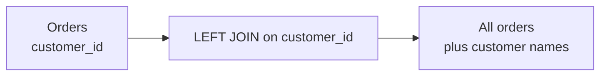
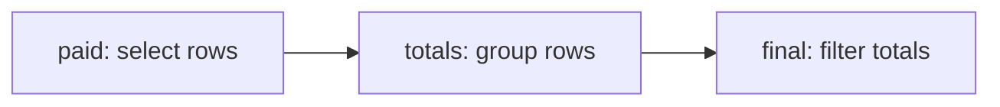
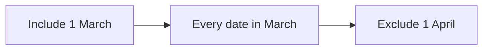
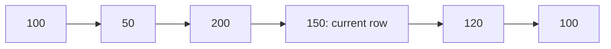
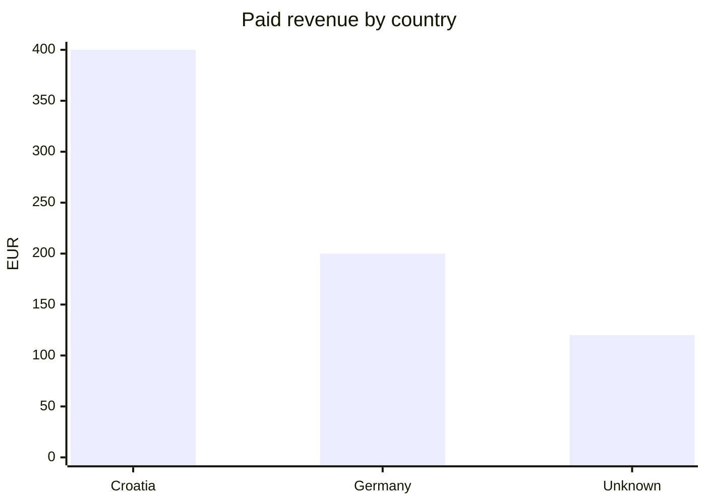

# SQL for Data Analytics


A concise, end-to-end PostgreSQL guide for answering data analytics questions. It starts with tables and filters, then builds through aggregation, joins, dates, window functions, data changes, performance, and one complete analytical query.

- [Download the complete SQL lesson notebook](https://github.com/ReneGreblicki/SQL_guide/blob/main/notebook/SQL_Lesson_Notebook.docx)
- [View and ](https://github.com/ReneGreblicki/SQL_guide/blob/main/notes/README.md) [download the concise SQL summary notes](https://github.com/ReneGreblicki/SQL_guide/tree/main/notes/download_notes)

> Start with a question and define the output grain: **what should one result row represent?**

## How to use this guide

1. Open PostgreSQL in pgAdmin, `psql`, or another SQL client.
2. Run the lesson-data setup once in a single connection.
3. Read the sections in order if you are new to SQL, or use the quick finder as a reference.
4. Replace the sample table names, columns, dates, and conditions with your own.
5. Validate totals, joins, NULL handling, dates, and denominators before drawing conclusions.

Temporary tables disappear when the connection closes. All amounts below are invented EUR values. `NULL` means unknown or absent; it does not mean zero.

## Learning path

| Stage | Topics |
|---|---|
| Foundations | Tables, rows, columns, keys, data types, `SELECT`, `WHERE`, `NULL` |
| Core analysis | Cleaning, `CASE`, aggregates, `GROUP BY`, `HAVING` |
| Combining data | Joins, subqueries, CTEs, set operations |
| Time and distributions | Date filters, percentiles, pivots |
| Advanced analysis | Window functions, rankings, frames, trends |
| Database operations | Constraints, DDL, DML, transactions, views |
| Reliability | `EXPLAIN`, indexes, reconciliation and troubleshooting |

## Query workflow



## Contents

1. [Think in tables](#think-in-tables)
2. [Set up the lesson data](#set-up-the-lesson-data)
3. [Choose columns and rows](#choose-columns-and-rows)
4. [Filters and missing values](#filters-and-missing-values)
5. [Types and useful calculations](#types-and-useful-calculations)
6. [Clean text and label rows](#clean-text-and-label-rows)
7. [Summarise with aggregates](#summarise-with-aggregates)
8. [Group, then filter groups](#group-then-filter-groups)
9. [Join tables without double counting](#join-tables-without-double-counting)
10. [Missing matches and subqueries](#missing-matches-and-subqueries)
11. [Build queries in stages](#build-queries-in-stages)
12. [Dates and dynamic filters](#dates-and-dynamic-filters)
13. [Percentiles and pivots](#percentiles-and-pivots)
14. [Window functions keep detail](#window-functions-keep-detail)
15. [Ranking and reusable windows](#ranking-and-reusable-windows)
16. [Frames: which rows count?](#frames-which-rows-count)
17. [First, last, previous, next](#first-last-previous-next)
18. [Trends and window filtering](#trends-and-window-filtering)
19. [Create tables and enforce rules](#create-tables-and-enforce-rules)
20. [Change rows and save queries](#change-rows-and-save-queries)
21. [Specialist patterns](#specialist-patterns)
22. [Make queries reliable and faster](#make-queries-reliable-and-faster)
23. [One complete analytical answer](#one-complete-analytical-answer)
24. [Quick finder and dialect notes](#quick-finder-and-dialect-notes)

---

## Think in tables

### Rows are records. Columns describe them.

A database holds related tables. A schema is a named container inside a
database. A table reference can be schema.table, such as public.orders.



| **customer_id** | **name** | **country** |
|-----------------|----------|-------------|
| 1               | Ana      | Croatia     |
| 2               | Ben      | Germany     |
| 3               | Cara     | Croatia     |
| 4               | Dan      | Spain       |

The customers table has one row per customer. customer_id is its primary
key: a unique, non-missing identifier. Names are labels, not reliable
keys.

| **order_id** | **customer_id** | **order_date** | **amount** | **status** |
|--------------|-----------------|----------------|------------|------------|
| 101          | 1               | 2025-01-05     | 100        | paid       |
| 102          | 1               | 2025-01-20     | 50         | paid       |
| 103          | 2               | 2025-02-03     | 200        | paid       |
| 104          | 3               | 2025-02-10     | NULL       | pending    |
| 105          | 2               | 2025-03-01     | 80         | cancelled  |
| 106          | 3               | 2025-03-15     | 150        | paid       |
| 107          | NULL            | 2025-03-20     | 120        | paid       |
| 108          | 1               | 2025-03-25     | 100        | paid       |

The orders table has one row per order: this is its grain. customer_id
is a foreign key linking each known customer to customers. One customer
can have many orders.

> All amounts are invented EUR values. NULL means unknown or absent; it
> does not mean zero. Paid revenue in this notebook is the sum of
> amounts where status = 'paid'.

A fact table records events or measurements, such as orders. A dimension
describes them, such as customers. Preserve the fact table’s grain when
joining dimensions.

## Set up the lesson data

### Run this whole block once in one session

```sql
CREATE TEMP TABLE customers (
customer_id INT PRIMARY KEY,
name TEXT NOT NULL,
country TEXT
);
CREATE TEMP TABLE orders (
order_id INT PRIMARY KEY,
customer_id INT REFERENCES customers(customer_id),
order_date DATE NOT NULL,
amount NUMERIC(10,2),
status TEXT NOT NULL
);
INSERT INTO customers VALUES
(1,'Ana','Croatia'), (2,'Ben','Germany'),
(3,'Cara','Croatia'), (4,'Dan','Spain');
INSERT INTO orders VALUES
(101,1,'2025-01-05',100,'paid'),
(102,1,'2025-01-20',50,'paid'),
(103,2,'2025-02-03',200,'paid'),
(104,3,'2025-02-10',NULL,'pending'),
(105,2,'2025-03-01',80,'cancelled'),
(106,3,'2025-03-15',150,'paid'),
(107,NULL,'2025-03-20',120,'paid'),
(108,1,'2025-03-25',100,'paid');
SELECT COUNT(*) AS order_count FROM orders;
```

**RESULT:** 8 ORDERS

CREATE makes a table; TEMP makes it session-only. INSERT adds records.
VALUES supplies each row in parentheses, in the table’s column order.
Later, prefer explicit column lists when inserting into real tables.

INT stores whole numbers. TEXT stores words. DATE stores a date.
NUMERIC(10,2) stores up to 10 decimal digits in total, including 2 after
the decimal point. NOT NULL makes a value compulsory.

> “Relation already exists” usually means you ran the setup twice.
> Reconnect to start a fresh session, then run it once. These tables do
> not alter your existing permanent tables.

## Choose columns and rows

### SELECT tells SQL what to return

```sql
-- Three largest paid orders
SELECT order_id, amount AS revenue
FROM orders
WHERE status = 'paid'
ORDER BY amount DESC, order_id
LIMIT 3;
```

| **order_id** | **revenue** |
|--------------|-------------|
| 103          | 200         |
| 106          | 150         |
| 107          | 120         |

#### Read the query

SELECT chooses output columns. FROM chooses the table. WHERE keeps
matching rows. AS gives an output a readable alias. ORDER BY sorts; DESC
means largest first, ASC means smallest first. LIMIT caps returned rows.

The second sort key, order_id, breaks ties. Without ORDER BY, row order
is not guaranteed; LIMIT alone does not define “top”.

```sql
SELECT DISTINCT country
FROM customers
ORDER BY country;
```

DISTINCT removes repeated output combinations. This returns Croatia,
Germany, Spain. With two selected columns, it removes duplicate pairs,
not duplicates in each column separately.

#### Syntax habits

Use single quotes for text: 'paid'. Use unquoted lowercase names for
ordinary identifiers. Double quotes refer to exact identifiers, such as
"Order Total". A semicolon ends a statement. SQL keywords are commonly
uppercase for readability.

-- comments last to the end of the line. /\* comments \*/ can span
lines. SELECT \* returns all columns; choose named columns for a focused
result.

> Read syntax as instructions, not as a formula to memorise. An
> expression calculates a value; a clause is a named part of a
> statement, such as WHERE.

## Filters and missing values

### A row stays only when WHERE is true

| **Test**       | **Syntax**                   | **Meaning**            |
|----------------|------------------------------|------------------------|
| Compare        | amount \>= 100               | At least 100           |
| Not equal      | status \<\> 'paid'           | Any known other status |
| Several values | status IN ('paid','pending') | Either listed value    |
| Range          | amount BETWEEN 50 AND 100    | Includes both ends     |
| Pattern        | name LIKE 'A%'               | Starts with A          |
| Missing        | amount IS NULL               | Value is absent        |
| Present        | amount IS NOT NULL           | Value exists           |

% matches any number of characters; \_ matches one. PostgreSQL ILIKE is
case-insensitive. AND requires both tests; OR requires either. NOT
reverses a known true/false condition. AND binds more tightly than OR,
so use parentheses.

```sql
SELECT order_id, amount
FROM orders
WHERE status = 'paid'
AND (amount >= 150 OR customer_id IS NULL)
ORDER BY order_id;
```

**RESULT:** ORDERS 103, 106, 107

NULL is unknown. amount = NULL does not test for missingness. Comparing
NULL with a number gives unknown, and WHERE removes that row.

```sql
SELECT order_id,
COALESCE(amount, 0) AS displayed_amount
FROM orders
WHERE amount IS NULL;
```

COALESCE returns the first non-NULL argument. Order 104 displays 0, but
the stored value stays NULL. Replace missing values only when that
meaning is appropriate.

> NOT IN can give surprising results if its list or subquery contains
> NULL. For “no matching record”, use NOT EXISTS in [Missing matches and subqueries](#missing-matches-and-subqueries). Sort missing
> values explicitly with NULLS FIRST or NULLS LAST.

## Types and useful calculations

### Choose types that match the meaning

| **Type**                | **Use**                                               | **Example**       |
|-------------------------|-------------------------------------------------------|-------------------|
| INT / BIGINT            | Whole numbers / larger whole numbers                  | 42                |
| NUMERIC(p,s)            | Exact decimal values                                  | NUMERIC(10,2)     |
| REAL / DOUBLE PRECISION | Approximate measurements                              | 3.14              |
| TEXT / VARCHAR(n)       | Text / text with length limit                         | 'Croatia'         |
| BOOLEAN                 | True, false or NULL                                   | TRUE              |
| DATE / TIME             | Calendar date / time of day                           | DATE '2025-01-05' |
| TIMESTAMP / TIMESTAMPTZ | Date-time / an instant displayed in session time zone | NOW()             |

CAST(value AS type) changes a value’s type. PostgreSQL also supports
value::type. A cast fails if the value cannot be converted. CHAR(n) pads
fixed-length text; TEXT is usually simpler.

```sql
SELECT CAST('12.50' AS NUMERIC) AS converted,
ROUND(100.0 * 3 / NULLIF(8, 0), 2) AS pct;
```

**RESULT:** 12.50 AND 37.50

\+ adds, - subtracts, \* multiplies, / divides, % finds the remainder.
Parentheses control arithmetic order. ROUND(value, 2) rounds a numeric
value to two decimal places. Integer division can truncate: 3 / 8 = 0;
use 3.0 / 8.

> **Core formulas**  
> Share % = part / total x 100  
> Growth % = (new - old) / old x 100

NULLIF(a,b) returns NULL when a equals b; otherwise it returns a.
NULLIF(denominator,0) prevents division by zero. The result is NULL when
the rate is undefined.

> Define the denominator first. A missing or zero baseline does not mean
> 0% growth. Round the final displayed result, not each input to a
> total.

## Clean text and label rows

### Standardise values before grouping them

| **Function**   | **Example**                       | **Result** |
|----------------|-----------------------------------|------------|
| TRIM           | TRIM(' Ana ')                     | Ana        |
| UPPER / LOWER  | LOWER('PAID')                     | paid       |
| CONCAT         | CONCAT('Order ',101)              | Order 101  |
| text \|\| text | 'A' \|\| 'B'                      | AB         |
| LENGTH         | LENGTH('Ana')                     | 3          |
| REPLACE        | REPLACE('A-B','-',' ')            | A B        |
| SUBSTRING      | SUBSTRING('Croatia' FROM 1 FOR 3) | Cro        |

```sql
SELECT COALESCE(NULLIF(TRIM(' '), ''), 'Unknown')
AS cleaned_value;
```

**READ INSIDE OUT:** TRIM makes an empty string; NULLIF turns it into NULL;
COALESCE supplies 'Unknown'. This is a label, not evidence that the
original value was known.

#### CASE chooses a value

```sql
SELECT order_id,
CASE
WHEN amount IS NULL THEN 'Unknown'
WHEN amount >= 150 THEN 'Large'
ELSE 'Standard'
END AS order_size
FROM orders
ORDER BY order_id;
```

CASE checks WHEN conditions in order and takes the first true THEN
result. ELSE is the fallback; without ELSE, unmatched rows return NULL.
END closes the expression. Order 104 is Unknown; 103 and 106 are Large.

A simple CASE can match exact values: CASE status WHEN 'paid' THEN
'Complete' ELSE 'Other' END.

> Inspect raw values first, clean in SELECT, compare results, then
> decide whether to update stored data. CONCAT ignores NULL arguments;
> \|\| with text normally returns NULL if either side is NULL.

## Summarise with aggregates

### Many input rows become one answer



```sql
SELECT COUNT(*) AS rows,
COUNT(amount) AS known_amounts,
SUM(amount) AS total,
ROUND(AVG(amount), 2) AS average,
MIN(amount) AS smallest,
MAX(amount) AS largest
FROM orders;
```

| **rows** | **known_amounts** | **total** | **average** | **smallest** | **largest** |
|----------|-------------------|-----------|-------------|--------------|-------------|
| 8        | 7                 | 800       | 114.29      | 50           | 200         |

COUNT(\*) counts rows. COUNT(column) counts non-NULL values. SUM adds;
AVG averages; MIN and MAX find extremes. These aggregates ignore NULL
inputs, except COUNT(\*) which counts each row.

COUNT(DISTINCT customer_id) counts different known customer IDs: 3.
COUNT on an empty input returns 0; SUM, AVG, MIN and MAX return NULL.

#### Conditional aggregation

```sql
SELECT COUNT(*) FILTER (WHERE status = 'paid') AS paid_orders,
SUM(amount) FILTER (WHERE status = 'paid') AS revenue
FROM orders;
```

**RESULT:** 6 PAID ORDERS / EUR 720

FILTER limits the rows entering one aggregate. The rest of the query can
still use all rows. A portable alternative for this total is SUM(CASE
WHEN status = 'paid' THEN amount ELSE 0 END).

> AVG(amount) is 800 / 7, not 800 / 8. Do not replace NULL with zero
> just to make arithmetic easier. Aggregates do not require GROUP BY
> when you want one whole-table answer.

## Group, then filter groups

### GROUP BY defines one result row per group

```sql
SELECT customer_id, COUNT(*) AS paid_orders,
SUM(amount) AS revenue
FROM orders
WHERE status = 'paid'
GROUP BY customer_id
HAVING SUM(amount) >= 200
ORDER BY revenue DESC;
```

| **customer_id** | **paid_orders** | **revenue** |
|-----------------|-----------------|-------------|
| 1               | 3               | 250         |
| 2               | 1               | 200         |

WHERE removes individual orders before grouping. GROUP BY combines rows
with the same customer_id. HAVING removes groups after aggregation. All
NULL customer IDs belong to one group.


\*The four groups include one unknown-customer group.

#### Write it in this order

```sql
SELECT grouping_column, SUM(value) AS total
FROM table_name
WHERE row_condition
GROUP BY grouping_column
HAVING SUM(value) > 0
ORDER BY total DESC
LIMIT 10;
```

This is a syntax template: replace the descriptive names with your own
columns and conditions.

Logical teaching order: FROM/JOIN → WHERE → GROUP BY → HAVING → window
calculations → SELECT → DISTINCT → ORDER BY → LIMIT. The physical
execution plan can differ.

> Selected columns should be grouped or aggregated (except supported
> functional-dependency cases). A SELECT alias is unavailable in WHERE
> or HAVING at the same query level; use the expression or an outer
> query.

## Join tables without double counting

### Match keys to add useful columns



```sql
SELECT o.order_id, c.name, o.amount
FROM orders AS o
LEFT JOIN customers AS c
ON o.customer_id = c.customer_id
ORDER BY o.order_id;
```

o and c are short table aliases. ON states how rows match. LEFT JOIN
keeps every order and adds the customer name when available. Order 107
remains, with a NULL name.

| **Join**        | **Keeps**                                   | **Rows with this lesson’s data** |
|-----------------|---------------------------------------------|----------------------------------|
| INNER JOIN      | Matching pairs only                         | 7                                |
| LEFT JOIN       | All left rows plus matches                  | 8: orders on the left            |
| RIGHT JOIN      | All right rows plus matches                 | 8: customers on the right        |
| FULL OUTER JOIN | Matches and unmatched rows from either side | 9                                |
| CROSS JOIN      | Every possible pair                         | 8 × 4 = 32                       |

The RIGHT JOIN count is 8 because Dan adds one unmatched row while
unknown-customer order 107 is excluded. FULL JOIN keeps both. A self
join joins a table to itself under different aliases, for example an
employee to their manager.

> If a key occurs twice on each side, it creates 2 × 2 = 4 matched rows.
> A join can inflate totals without raising an error. Check key
> uniqueness; aggregate child records first when needed.

A one-to-many relationship has one parent and several children.
Many-to-many matching multiplies rows. Join types describe which matches
survive; they do not guarantee one result row per input row.

## Missing matches and subqueries

### Use EXISTS when only presence matters

```sql
-- Customers with no paid order
SELECT c.customer_id, c.name
FROM customers c
WHERE NOT EXISTS (
SELECT 1
FROM orders o
WHERE o.customer_id = c.customer_id
AND o.status = 'paid'
);
```

**RESULT:** 4 / DAN

EXISTS is true if the subquery returns any row. SELECT 1 is a
convention: the selected value is irrelevant. NOT EXISTS means no match.
This is a correlated subquery because it refers to c from the outer
query.

A LEFT JOIN alternative puts the paid condition in ON, then filters
WHERE o.order_id IS NULL. Testing the non-nullable child key identifies
a missing match.

> A filter on the right table in WHERE can remove unmatched rows from a
> LEFT JOIN. Put eligibility in ON if unmatched left rows should remain.

#### Compare with one calculated value

```sql
SELECT order_id, amount
FROM orders
WHERE amount > (SELECT AVG(amount) FROM orders)
ORDER BY order_id;
```

**RESULT:** ORDERS 103, 106, 107

A scalar subquery returns one column and at most one row. Here it
supplies the average, about 114.29. More than one row causes an error;
no row yields NULL.

A subquery in FROM is a temporary result used as a table: SELECT \* FROM
(SELECT order_id FROM orders) AS x; Give it a clear alias. IN (SELECT
...) tests membership; prefer NOT EXISTS for missing matches when NULL
may occur.

## Build queries in stages

### CTEs name steps; set operators stack results

```sql
WITH paid AS (
SELECT customer_id, amount
FROM orders WHERE status = 'paid'
), totals AS (
SELECT customer_id, SUM(amount) AS revenue
FROM paid GROUP BY customer_id
)
SELECT * FROM totals
WHERE revenue >= 200
ORDER BY revenue DESC;
```

WITH introduces a common table expression (CTE). Each CTE is a named
result used by the statement that follows. Commas separate steps. This
returns customer 1 / 250 and customer 2 / 200.



A CTE is not a stored table and does not automatically make SQL faster.
PostgreSQL may inline or materialize it; choose it first for readable
logic.

| **Operator** | **Given A = {1,2}, B = {2,3}** |
|--------------|--------------------------------|
| UNION ALL    | 1, 2, 2, 3: keeps repeats      |
| UNION        | 1, 2, 3: removes repeats       |
| INTERSECT    | 2: present in both             |
| EXCEPT       | 1: in A but not B              |

```sql
SELECT country FROM customers WHERE customer_id <= 2
UNION
SELECT country FROM customers WHERE customer_id >= 3
ORDER BY country;
```

**RESULT:** CROATIA, GERMANY, SPAIN

Set operators align columns by position. Inputs need the same number of
columns with compatible types. Output order requires a final ORDER BY.

> JOIN adds matching columns horizontally. UNION ALL stacks compatible
> rows vertically. UNION ALL avoids deduplication work, but use it only
> when keeping repeats is correct.

## Dates and dynamic filters

### Use clear time boundaries

```sql
SELECT order_id, order_date,
EXTRACT(MONTH FROM order_date) AS month_no,
DATE_TRUNC('month', order_date)::date AS month
FROM orders
WHERE order_date >= DATE '2025-03-01'
AND order_date < DATE '2025-04-01';
```

**RESULT:** FOUR MARCH ORDERS

EXTRACT gets one part, such as YEAR, MONTH or DAY. DATE_TRUNC moves a
value to the start of a period. ::date casts that result to a date.



A half-open range includes the start and excludes the next start. It
also works for timestamps, avoiding fragile “last second of the month”
filters.

| **Expression**                            | **Meaning**                           |
|-------------------------------------------|---------------------------------------|
| CURRENT_DATE                              | Today in the session time zone        |
| NOW()                                     | Current transaction’s start timestamp |
| DATE '2025-03-15' + INTERVAL '7 days'     | Add a duration                        |
| DATE '2025-03-15' - DATE '2025-03-01'     | 14 days                               |
| AGE(DATE '2025-03-15', DATE '2025-01-05') | Calendar interval: 2 months 10 days   |

```sql
-- Last complete calendar month: moves with today's date
SELECT * FROM orders
WHERE order_date >=
DATE_TRUNC('month', CURRENT_DATE) - INTERVAL '1 month'
AND order_date < DATE_TRUNC('month', CURRENT_DATE);
```

> This dynamic example may return no rows because the sample is from
> 2025. For elapsed time, NOW() - INTERVAL '720 hours' means exactly 720
> hours earlier; calendar-day intervals can differ around
> daylight-saving changes. Define the reporting time zone before
> grouping instants.

## Percentiles and pivots

### Find a typical value or reshape a summary

```sql
SELECT PERCENTILE_CONT(0.5)
WITHIN GROUP (ORDER BY amount) AS median,
PERCENTILE_CONT(0.9)
WITHIN GROUP (ORDER BY amount) AS p90
FROM orders;
```

**KNOWN VALUES:** 50, 80, 100, 100, 120, 150, 200

The median is the middle of the sorted distribution (the 50th
percentile). p90 marks its 90th-percentile threshold. Here median = 100
and p90 = 170. PERCENTILE_CONT interpolates between neighbouring values
when needed. For 7 values, p90 lies 90% of the way from first to last:
position 1 + 0.9 × 6 = 6.4, giving 150 + 0.4 × 50 = 170.

PERCENTILE_DISC(0.9) returns an observed value: 200 here. The percentile
input runs from 0 to 1. WITHIN GROUP supplies the ordered values; NULL
amounts are ignored. A percentile describes a distribution; it does not
prove a trend.

#### Pivot categories into columns

```sql
SELECT
SUM(amount) FILTER (WHERE status = 'paid') AS paid,
SUM(amount) FILTER (WHERE status = 'cancelled') AS cancelled,
SUM(amount) FILTER (WHERE status = 'pending') AS pending
FROM orders;
```

| **paid** | **cancelled** | **pending** |
|----------|---------------|-------------|
| 720      | 80            | NULL        |

The categories become columns. Add GROUP BY customer_id to make one row
per customer. PostgreSQL has no generic PIVOT keyword; conditional
aggregation is a clear solution for known categories.

> The pending amount is unknown, not zero. COALESCE can display zero
> only if your metric definition allows it. SUM(CASE WHEN status =
> 'paid' THEN amount END) is an alternative to FILTER.

## Window functions keep detail

### Calculate across rows without collapsing them

| Approach | Result |
|---|---|
| `GROUP BY customer_id` | Three orders become one customer total |
| `SUM(amount) OVER (PARTITION BY customer_id)` | Three orders remain three rows, each with the customer total |

```sql
SELECT order_id, customer_id, amount,
SUM(amount) OVER () AS all_paid_revenue,
SUM(amount) OVER (PARTITION BY customer_id)
AS customer_revenue
FROM orders
WHERE status = 'paid'
ORDER BY order_id;
```

| **order_id** | **customer_id** | **amount** | **all_paid_revenue** | **customer_revenue** |
|--------------|-----------------|------------|----------------------|----------------------|
| 101          | 1               | 100        | 720                  | 250                  |
| 102          | 1               | 50         | 720                  | 250                  |
| 103          | 2               | 200        | 720                  | 200                  |

The remaining three paid rows follow the same rule. A window function
returns a value for every input row. OVER () uses the whole input.
PARTITION BY splits it into independent groups while preserving rows.

#### The three parts of OVER

PARTITION BY decides whose rows belong together. ORDER BY decides
sequence within that partition. A frame chooses the nearby rows used by
frame-sensitive calculations in [Frames: which rows count?](#frames-which-rows-count).

```sql
SELECT order_id,
ROUND(100.0 * amount /
NULLIF(SUM(amount) OVER (), 0), 2) AS share_pct
FROM orders WHERE status = 'paid';
```

Order 103 contributes 27.78% of paid revenue. Windows see rows after
WHERE and grouping, so the denominator here is paid revenue only.

> GROUP BY reduces rows. OVER preserves rows. The window’s ORDER BY
> controls calculations; a final ORDER BY controls display order.

## Ranking and reusable windows

### Decide how ties should behave

```sql
SELECT order_id, amount,
ROW_NUMBER() OVER (ORDER BY amount DESC, order_id) AS rn,
RANK() OVER w AS rank,
DENSE_RANK() OVER w AS dense_rank
FROM orders WHERE status = 'paid'
WINDOW w AS (ORDER BY amount DESC)
ORDER BY amount DESC, order_id;
```

| **amount** | **ROW_NUMBER** | **RANK** | **DENSE_RANK** |
|------------|----------------|----------|----------------|
| 200        | 1              | 1        | 1              |
| 150        | 2              | 2        | 2              |
| 120        | 3              | 3        | 3              |
| 100        | 4              | 4        | 4              |
| 100        | 5              | 4        | 4              |
| 50         | 6              | 6        | 5              |

ROW_NUMBER gives every row a different number; add a unique tie-breaker
for stable choices. RANK gives ties the same rank, leaving gaps.
DENSE_RANK gives ties the same rank without gaps.

WINDOW w AS (...) names a reusable window definition. Functions refer to
it with OVER w. Add PARTITION BY customer_id to restart rankings for
each customer.

#### Less common distribution functions

NTILE(4) OVER (ORDER BY amount) splits rows into four nearly equal
buckets, numbered from 1; ties can split across buckets.

PERCENT_RANK() OVER (...) = (rank − 1) / (partition row count − 1), with
0 for a one-row partition.

CUME_DIST() OVER (...) = rows up to and including the current peer group
/ partition row count. Peers share the same window ORDER BY values.

> To return exactly three rows, filter ROW_NUMBER \<= 3 in an outer
> query. To include everyone tied at the third rank, filter RANK \<= 3.
> See [Trends and window filtering](#trends-and-window-filtering) for the pattern.

## Frames: which rows count?

### A partition is the group; a frame is the slice



For the current value `150`, `ROWS BETWEEN 2 PRECEDING AND CURRENT ROW` uses `50`, `200`, and `150`.

```sql
SELECT order_id, amount,
SUM(amount) OVER (
ORDER BY order_date, order_id
ROWS BETWEEN UNBOUNDED PRECEDING AND CURRENT ROW
) AS running_revenue
FROM orders WHERE status = 'paid'
ORDER BY order_date, order_id;
```

**RUNNING TOTALS:** 100, 150, 350, 500, 620, 720

ROWS counts physical rows. RANGE uses ordering values and includes
peers. GROUPS counts peer groups. PRECEDING means earlier; FOLLOWING
means later; CURRENT ROW marks the current boundary; UNBOUNDED reaches
the partition edge.

| **Frame**                                                | **Includes**                                                                      |
|----------------------------------------------------------|-----------------------------------------------------------------------------------|
| ROWS BETWEEN 2 PRECEDING AND CURRENT ROW                 | Current row and up to 2 earlier rows                                              |
| ROWS BETWEEN UNBOUNDED PRECEDING AND UNBOUNDED FOLLOWING | Whole partition                                                                   |
| RANGE BETWEEN 20 PRECEDING AND CURRENT ROW               | Values from current value − 20 through current value, for ascending numeric order |
| GROUPS BETWEEN 1 PRECEDING AND CURRENT ROW               | Current peer group and previous peer group                                        |

For ordered amounts 50, 100, 100, 120, at the second 100: ROWS 1
PRECEDING sums 200; RANGE 20 PRECEDING sums 200; GROUPS 1 PRECEDING sums
250. ROWS needs a tie-breaker to identify a specific tied row reliably.

> With window ORDER BY and no explicit frame, the usual default ends at
> the current row’s last peer. Equal values can make running totals jump
> together. Specify ROWS for a row-by-row total. Offset RANGE requires
> one ordering expression of a compatible type.

## First, last, previous, next

### Position depends on the window order

```sql
SELECT order_id, amount,
FIRST_VALUE(amount) OVER w AS first_amount,
LAST_VALUE(amount) OVER w AS last_amount,
NTH_VALUE(amount, 2) OVER w AS second_amount
FROM orders
WHERE status = 'paid' AND customer_id = 1
WINDOW w AS (
ORDER BY order_date, order_id
ROWS BETWEEN UNBOUNDED PRECEDING AND UNBOUNDED FOLLOWING
)
ORDER BY order_date, order_id;
```

**ANA’S SEQUENCE:** 100, 50, 100

Every row shows first = 100, last = 100, second = 50. FIRST_VALUE takes
the first value in the frame; LAST_VALUE takes the last;
NTH_VALUE(value,n) takes position n, counting from 1. It returns NULL
when that position does not exist.

> The common typo `NHT_VALUE` means NTH_VALUE. LAST_VALUE’s default ordered
> frame often ends at the current peer, not the partition’s final row.
> Use UNBOUNDED FOLLOWING for the final value.

```sql
SELECT order_id, amount,
LAG(amount) OVER (ORDER BY order_date, order_id) AS prior,
LEAD(amount) OVER (ORDER BY order_date, order_id) AS next
FROM orders WHERE status = 'paid'
ORDER BY order_date, order_id;
```

LAG looks back one row; LEAD looks forward one. LAG(value,2,0) looks
back two rows and uses 0 only when that row does not exist. An existing
row with a NULL value stays NULL.

Unlike the positional functions above, LAG and LEAD use partition order
rather than frame boundaries. PostgreSQL respects NULLs here; it does
not implement IGNORE NULLS.

## Trends and window filtering

### Make time regular before comparing periods

```sql
WITH months AS (
SELECT GENERATE_SERIES(DATE '2025-01-01', DATE '2025-03-01',
INTERVAL '1 month')::date AS month
), totals AS (
SELECT DATE_TRUNC('month', order_date)::date AS month,
SUM(amount) AS revenue
FROM orders WHERE status = 'paid' GROUP BY 1
), series AS (
SELECT m.month, COALESCE(t.revenue, 0) AS revenue
FROM months m LEFT JOIN totals t USING (month)
), trend AS (
SELECT *, LAG(revenue) OVER (ORDER BY month) AS prior,
AVG(revenue) OVER (ORDER BY month
ROWS BETWEEN 2 PRECEDING AND CURRENT ROW) AS average_3m
FROM series
)
SELECT month, revenue, ROUND(average_3m, 2) AS average_3m,
ROUND(100.0 * (revenue-prior) / NULLIF(prior,0), 2) AS growth_pct
FROM trend ORDER BY month;
```

| **Month** | **Revenue** | **Average: up to 3 months** | **Growth %** |
|-----------|-------------|-----------------------------|--------------|
| Jan       | 150         | 150                         | NULL         |
| Feb       | 200         | 175                         | 33.33        |
| Mar       | 370         | 240                         | 85.00        |

GENERATE_SERIES makes a calendar spine. USING(month) matches equal
same-named columns. GROUP BY 1 groups by the first SELECT expression.
Missing months become zero only because we assume complete order
coverage and no orders means no revenue.

A moving average smooths noise but delays visible turning points. The
first two values use fewer than three months. An absent month without a
spine would make “previous row” differ from “previous month”.

#### Filter after a window calculation

```sql
WITH ranked AS (
SELECT *, ROW_NUMBER() OVER (ORDER BY amount DESC, order_id) AS rn
FROM orders WHERE status = 'paid'
)
SELECT * FROM ranked WHERE rn <= 3 ORDER BY rn;
```

A window result cannot be filtered in the same query’s WHERE. Put it in
a CTE first. To display March while preserving January–February in its
average, filter month in the final SELECT.

## Create tables and enforce rules

### DDL changes database structure

```sql
CREATE TEMP TABLE scratch_items (
item_id INT GENERATED ALWAYS AS IDENTITY PRIMARY KEY,
name VARCHAR(100) NOT NULL,
sku TEXT UNIQUE,
quantity INT DEFAULT 0 CHECK (quantity >= 0)
);
ALTER TABLE scratch_items ADD COLUMN price NUMERIC(10,2);
ALTER TABLE scratch_items RENAME COLUMN name TO item_name;
ALTER TABLE scratch_items ALTER COLUMN item_name TYPE TEXT;
ALTER TABLE scratch_items DROP COLUMN price;
DROP TABLE scratch_items;
```

CREATE creates an object; ALTER changes its structure; DROP removes it.
DDL means data definition language. GENERATED ... AS IDENTITY
automatically supplies an integer. Gaps can occur; it is not a gapless
row count.

| **Constraint**           | **Rule**                                    |
|--------------------------|---------------------------------------------|
| PRIMARY KEY              | Unique and NOT NULL; one key per table      |
| FOREIGN KEY / REFERENCES | Non-NULL values must match a referenced key |
| NOT NULL                 | Value is required                           |
| UNIQUE                   | Prevent repeated non-NULL keys by default   |
| CHECK (condition)        | Reject rows when condition is false         |
| DEFAULT value            | Supplies a value when the column is omitted |

A composite primary key uses multiple columns: PRIMARY KEY (order_id,
item_id). CHECK alone allows NULL because unknown is not false; add NOT
NULL when required.

Foreign-key actions: ON DELETE CASCADE deletes children with their
parent; ON UPDATE CASCADE propagates key changes; RESTRICT blocks
changes with dependants; SET NULL clears references if allowed. The
default NO ACTION can allow deferred checking when configured.

> DDL on real objects affects other users. IF EXISTS suppresses a
> missing-object error; it does not make DROP harmless. CREATE DATABASE
> name; and DROP DATABASE name; need privileges and run outside
> transaction blocks. Reconnect to switch databases in PostgreSQL.

## Change rows and save queries

### DML changes data; transactions group changes

```sql
BEGIN;
CREATE TEMP TABLE scratch_changes (id INT PRIMARY KEY, amount
NUMERIC);
INSERT INTO scratch_changes (id, amount) VALUES (1,100), (2,50);
UPDATE scratch_changes SET amount = 60 WHERE id = 2 RETURNING *;
DELETE FROM scratch_changes WHERE id = 1 RETURNING *;
ROLLBACK;
```

INSERT adds; UPDATE edits; DELETE removes rows. RETURNING shows affected
values: 2 / 60 after UPDATE and 1 / 100 after DELETE. BEGIN starts a
transaction; COMMIT accepts it; ROLLBACK undoes it, including this
temporary table’s creation. After a transaction error, ROLLBACK before
continuing.

> Without WHERE, UPDATE and DELETE affect all rows. Preview the same
> filter with SELECT first. TRUNCATE removes all rows, with different
> locking and trigger rules. DROP removes the object itself.

An upsert inserts or updates a conflicting key:

```sql
-- Syntax template: replace table and column names
INSERT INTO target (id, amount) VALUES (1, 60)
ON CONFLICT (id) DO UPDATE SET amount = EXCLUDED.amount;
```

ON CONFLICT needs a suitable unique key. EXCLUDED contains the proposed
incoming values.

#### Views reuse a query

```sql
CREATE TEMP VIEW paid_orders AS
SELECT * FROM orders WHERE status = 'paid';
SELECT SUM(amount) FROM paid_orders;
ALTER VIEW paid_orders RENAME TO paid_orders_saved;
DROP VIEW paid_orders_saved;
```

A view stores a query definition, not a snapshot. CREATE OR REPLACE VIEW
replaces a compatible definition; ALTER VIEW changes properties such as
its name. A materialized view stores results: CREATE MATERIALIZED VIEW
report AS SELECT ...; refresh it with REFRESH MATERIALIZED VIEW report;
when data changes. Views do not automatically guarantee security.

## Specialist patterns

### Recognise these; use them when needed

#### Recursive CTE

```sql
WITH RECURSIVE numbers(n) AS (
SELECT 1
UNION ALL
SELECT n + 1 FROM numbers WHERE n < 5
)
SELECT n FROM numbers ORDER BY n;
```

Result: 1–5. The first SELECT is the anchor. The second repeats until
the condition stops it. Recursion is useful for hierarchies; guard
against cycles.

#### Stored function

```sql
CREATE FUNCTION pg_temp.pct_change(new_val NUMERIC, old_val NUMERIC)
RETURNS NUMERIC LANGUAGE SQL IMMUTABLE AS $$
SELECT 100.0 * (new_val-old_val) / NULLIF(old_val,0);
$$;
SELECT pg_temp.pct_change(370,200); -- 85
DROP FUNCTION pg_temp.pct_change(NUMERIC, NUMERIC);
```

Arguments are inputs; RETURNS declares the output type; \$\$ encloses
the body. IMMUTABLE promises the same result for the same inputs,
suitable for this arithmetic. A scalar function returns a value; an
aggregate summarises rows; a window function uses OVER.

#### Trigger

```sql
CREATE TEMP TABLE scratch_t (id INT, changed_at TIMESTAMPTZ);
CREATE FUNCTION pg_temp.stamp() RETURNS TRIGGER LANGUAGE plpgsql AS
$$
BEGIN NEW.changed_at := NOW(); RETURN NEW; END;
$$;
CREATE TRIGGER stamp_row BEFORE INSERT OR UPDATE ON scratch_t
FOR EACH ROW EXECUTE FUNCTION pg_temp.stamp();
```

BEFORE runs before the change; AFTER runs afterward. NEW is the incoming
row; OLD is the previous row for UPDATE/DELETE. RETURN NEW accepts a
BEFORE row change. PL/pgSQL is PostgreSQL’s procedural language.
Triggers are rarely needed for analysis queries.

#### Subtotals

GROUP BY GROUPING SETS ((customer_id), ()) requests customer totals and
a grand total. GROUPING(customer_id) is 1 for the grand total,
distinguishing it from an unknown-customer group. ROLLUP(a,b) adds
hierarchical subtotals; CUBE(a,b) requests every grouping combination.

## Make queries reliable and faster

### Check correctness before tuning

```sql
EXPLAIN SELECT * FROM orders WHERE order_date >= DATE '2025-03-01';
EXPLAIN (ANALYZE, BUFFERS)
SELECT * FROM orders WHERE order_date >= DATE '2025-03-01';
```

EXPLAIN estimates a plan without running the SELECT. EXPLAIN ANALYZE
executes it and reports actual work. BUFFERS adds buffer activity.
ANALYSE is an accepted PostgreSQL spelling; ANALYZE is conventional.

| **Plan term**                        | **Read it as**                       |
|--------------------------------------|--------------------------------------|
| Seq Scan / Index Scan                | Read table rows / use an index       |
| Filter / Sort / Aggregate            | Test rows / order rows / summarise   |
| Nested Loop / Hash Join / Merge Join | Different matching methods           |
| cost                                 | Planner estimate, not milliseconds   |
| rows / loops                         | Rows per execution / execution count |

Read from child operations toward parents. Compare estimated and actual
rows; large differences can indicate poor statistics. Node times can
overlap because parent work includes child work.

```sql
CREATE INDEX orders_date_idx ON orders(order_date);
ANALYZE orders;
```

An index can speed lookups but costs storage and write work. ANALYZE
orders updates planner statistics; it is not EXPLAIN ANALYZE. Eight
example rows are too few for a useful speed benchmark.

> Filter raw rows with WHERE; aggregate tests belong in HAVING. Group
> only at the required grain. Remove a JOIN only if its filtering and
> row multiplication are unnecessary. Remove redundant GROUP BY or
> DISTINCT only if the answer stays correct.

Limit output columns, avoid unnecessary sorting, and use direct date
ranges where appropriate. LIMIT does not automatically cap grouping
work. CTEs and indexes are not universal speed fixes; compare results
and measured plans.

#### Troubleshoot quickly

“Column ambiguous”: qualify it with an alias. “Relation missing”: check
database, schema and session. “Must appear in GROUP BY”: check output
grain. Wrong totals: check joins, NULLs and denominator. In psql, \dt
lists tables and \d orders describes orders; these are client commands,
not SQL for pgAdmin.

## One complete analytical answer

### Which countries contributed paid revenue in Q1?

Define the population: paid orders, January–March 2025. Metric: sum of
known EUR amounts. Output grain: one row per country, including unknown.
Denominator: all paid revenue in that same period.

```sql
WITH totals AS (
SELECT COALESCE(c.country, 'Unknown') AS country,
COUNT(*) AS paid_orders, SUM(o.amount) AS revenue
FROM orders o
LEFT JOIN customers c ON o.customer_id = c.customer_id
WHERE o.status = 'paid'
AND o.order_date >= DATE '2025-01-01'
AND o.order_date < DATE '2025-04-01'
GROUP BY COALESCE(c.country, 'Unknown')
)
SELECT country, paid_orders, revenue,
ROUND(100.0 * revenue /
NULLIF(SUM(revenue) OVER (), 0), 2) AS share_pct
FROM totals
ORDER BY revenue DESC, country;
```

| **country** | **paid_orders** | **revenue** | **share_pct** |
|-------------|-----------------|-------------|---------------|
| Croatia     | 4               | 400         | 55.56         |
| Germany     | 1               | 200         | 27.78         |
| Unknown     | 1               | 120         | 16.67         |



#### Read the answer

Croatia contributes the largest share in this invented sample. EUR 120
has no known country. Spain is absent because Dan has no paid orders;
showing Spain with zero would require a customer-based grid.

#### Verify before concluding

Order counts reconcile: 4 + 1 + 1 = 6. Revenue reconciles: 400 + 200 +
120 = 720. Rounded shares sum to 100.01%, a rounding effect. Check
COUNT(amount) alongside COUNT(\*) to expose missing metric values.

> For real analysis, record the population, grain, units, date
> boundaries and NULL policy. Compare equivalent periods. A correct
> query does not prove the data is complete or representative.

## Quick finder and dialect notes

### Jump to a topic

| Topic | Section |
|---|---|
| SELECT, aliases, sorting and limits | [Choose columns and rows](#choose-columns-and-rows) |
| WHERE, comparisons, patterns and NULL | [Filters and missing values](#filters-and-missing-values) |
| Types, CAST, ROUND, NULLIF and percentages | [Types and useful calculations](#types-and-useful-calculations) |
| Text functions and CASE | [Clean text and label rows](#clean-text-and-label-rows) |
| COUNT, SUM, AVG, MIN, MAX and FILTER | [Summarise with aggregates](#summarise-with-aggregates) |
| GROUP BY and HAVING | [Group, then filter groups](#group-then-filter-groups) |
| JOINs, keys and cardinality | [Join tables without double counting](#join-tables-without-double-counting) |
| EXISTS and subqueries | [Missing matches and subqueries](#missing-matches-and-subqueries) |
| CTEs and set operators | [Build queries in stages](#build-queries-in-stages) |
| Dates and dynamic filters | [Dates and dynamic filters](#dates-and-dynamic-filters) |
| Percentiles and pivots | [Percentiles and pivots](#percentiles-and-pivots) |
| Window functions, rankings and frames | [Window functions keep detail](#window-functions-keep-detail) |
| LAG, LEAD and positional functions | [First, last, previous, next](#first-last-previous-next) |
| Moving averages and window filtering | [Trends and window filtering](#trends-and-window-filtering) |
| DDL, DML, constraints, views and transactions | [Create tables and enforce rules](#create-tables-and-enforce-rules) |
| Recursion, functions, triggers and subtotals | [Specialist patterns](#specialist-patterns) |
| EXPLAIN, indexes and troubleshooting | [Make queries reliable and faster](#make-queries-reliable-and-faster) |

### MySQL-to-PostgreSQL translation

PostgreSQL uses connection switching instead of `USE database`; `IDENTITY` instead of `AUTO_INCREMENT`; `TIMESTAMP` instead of `DATETIME`; `CURRENT_DATE` instead of `CURDATE()`; `EXTRACT` instead of `YEAR()`/`MONTH()`; and `ALTER COLUMN ... TYPE` instead of `MODIFY COLUMN`. Joins are operations, not join functions.

### Official PostgreSQL reference

PostgreSQL 18 documentation was checked for the original notebook. These
links support the exact syntax and behaviours used here; see the
relevant chapter for specialist options.

- [SELECT](https://www.postgresql.org/docs/18/sql-select.html)
- [Common table expressions](https://www.postgresql.org/docs/18/queries-with.html)
- [Functions and operators](https://www.postgresql.org/docs/18/functions.html)
- [Expressions](https://www.postgresql.org/docs/18/sql-expressions.html)
- [Data definition](https://www.postgresql.org/docs/18/ddl.html)
- [Transactions](https://www.postgresql.org/docs/18/tutorial-transactions.html)
- [Triggers](https://www.postgresql.org/docs/18/plpgsql-trigger.html)
- [Using EXPLAIN](https://www.postgresql.org/docs/18/using-explain.html)

Examples use one invented dataset throughout. The guide is designed as a concise reference and contains no practice questions.
